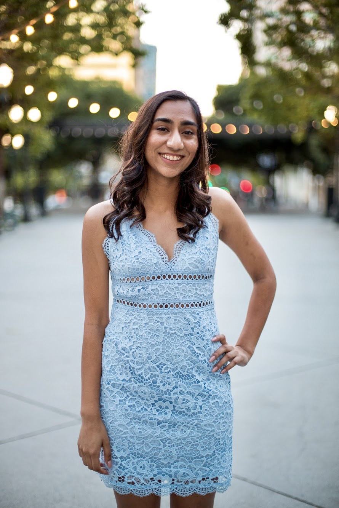

### Scroll down to learn more [about me](#About-me)!

## **About me**:



 Hi, I'm Anokhi!
- I am a sophmore studying Computer Science at UCSD
- I am a CSE 110 Software Engineering Student
- I hope to become a software engineer one day!
- I love to dance and I'm a dancer on UCSD's collegiate raas-garba dance team called UCSD Raas Ruckus
##### *Click [here](https://www.youtube.com/watch?v=IEmuCr9zv6I) to watch one of our performances*! 
##### *Here's a picture of me and my team at one of my dance competitions:* 


- I am also a participant in SFL and am an active member of Phi Sigma Rho!

## My favorite foods:
1. Pad thai
2. Spicy fried rice
3. Boba
4. Ramen

Here is the first line of code I ever wrote:
```
System.out.print("Hello World!);
```

Here is my README if you would like to learn something else about me!
I love git.

##Some languages that I have learned include:
- Java
- C++
- C
- Javascript
- Swift

Here's a quote that I think applies to Computer Science very well!
As Albert Einstein said:
> Creativity is intelligence having fun

I used [GitHub Docs](https://docs.github.com/en/github/writing-on-github/basic-writing-and-formatting-syntax) to help me create this page.
