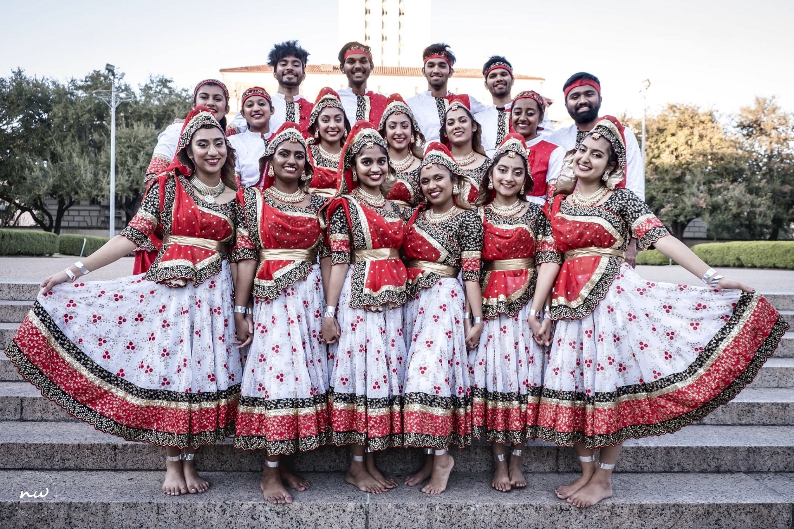

## **About me**:

 Hi 👋, I'm Anokhi!
- I am a sophmore studying Computer Science 💻 at UCSD
- I am a CSE 110 Software Engineering Student
- I hope to become a software engineer 🏢 one day!
- I am a part of SFL and am an active member of Phi Sigma Rho!
- I love to dance and I'm a dancer 💃 on UCSD's collegiate raas-garba dance team called UCSD Raas Ruckus
##### *Click [here](https://www.youtube.com/watch?v=IEmuCr9zv6I) to watch one of our performances*! 
##### *Here's a picture of me and my team at one of my dance competitions:* 




### My favorite foods:
1. Noodles
2. Potatoes in any form LOL 🍟
3. Boba or Coffee ☕

*Here is the first line of code I ever wrote:*
```
System.out.print("Hello World!);
```

Here is my [README](https://github.com/anokhimehta/User-Page/blob/main/README.md) if you would like to learn something else about me!

Some **languages** that I have learned include:
- Java
- C++
- C
- Javascript
- Swift

Some **goals** I have for this quarter are:
- [ ] Become familiar with the software development process
- [ ] Get straight A's
- [ ] Be more outgoing and try to meet people virtually!
- [ ] Learn new skills such as React and Angular

Here's a **quote** that I think applies to Computer Science very well!
As *Albert Einstein* said:
> Creativity is intelligence having fun

I used [GitHub Docs](https://docs.github.com/en/github/writing-on-github/basic-writing-and-formatting-syntax) to help me create this page.

Click here to go back to the [top](#about-me) of the page!
